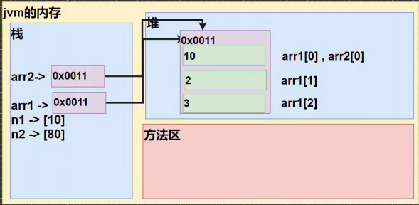

# Shahibag的Java笔记之语言基础

> 在此整理关于Java的知识点


# 变量和数据类型

变量表示内存中的一个存储区域，不同的变量，类型不同，占用的空间大小不一样。

## 变量的特性及细节

1. 变量必须先定义，再使用
2. 变量可以被重新赋值，但必须是相同类型的数据
3. 同一个作用域内的两个变量不能重名
4. 变量名必须以字母开头，不能包含空格，不能使用保留名作为变量名

```java
public class Main{
    public static void main(String[] args){
        //定义的同时赋值
        int num = 10; //int 是变量类型，num是变量名，而10是变量的值
        //先声明再赋值
        int num;
        num = 10;
	}
}
```

编写风格：尽量不要在同一行中声明多个变量；变量的声明尽可能靠近变量第一次使用的地方。


## 基本数据类型

在Java中，变量分为两种：基本类型的变量和引用类型的变量。

基本数据类型是CPU可以直接进行运算的类型，Java中有8种基本类型：

|        | 基本类型 | 位数 | 字节 | 默认值  |
| ------ | -------- | ---- | ---- | ------- |
| 整型   | byte     | 8    | 1    | 0       |
| 整型   | short    | 16   | 2    | 0       |
| 整型   | int      | 32   | 4    | 0       |
| 整型   | long     | 64   | 8    | 0L      |
| 浮点型 | float    | 32   | 4    | 0f      |
| 浮点型 | double   | 64   | 8    | 0d或0   |
| 字符型 | char     | 16   | 2    | 'u0000' |
| 布尔型 | boolean  | 1    |      | false   |

### 整型-int

整数类型就是用于存放整数值的数据类型。

#### 整型的特性及细节

1. Java中整数类型的范围和字段长度是固定的，不受硬件和操作系统的影响，以保证Java程序的可移植性
2. 声明long变量时需要在变量值后加'l'或'L':`long l = 10000000000L;`
3. 通常整型变量用int就足够，除非有需要，尽量不使用long

### 浮点类型-double

浮点类型可以表示小数。double的数值精度为float的两倍，因此也成为双精度数值。

#### 浮点类型的特性及细节

1. 声明float变量时需要在变量值后加'f'或'F' ：`float f = 0.2f;`
2. 很多情况下float精度满足不了需求，故绝大多数程序都采用double。
3. 判断两个小数是否相等时需要小心。 

### 字符类型-char

 字符类型可以表示单个字符，字符类型是char，是两个字节（可以存放汉字）。

#### 字符型的特性及细节

1. 字符常量是用单引号(' ')括起来的单个字符
2. 允许使用转义字符‘\’来将其后的字符转变为特殊字符常量
3. 在Java中，char的本质是一个整数，可以直接给char赋一个整数，输出时会按照Unicode码对应的字符输出

4. char类型是可以进行运算的，运算时看作是Unicode字符对应的码

```java
public class Main{
    public static void main(String[] args){
        char c1 = 'a';
        char c2 = 98; //输出98对应的Unicode字符
        char c3 = 'a' + 2; //输出97+2=99对应的Unicode字符
        char c4 = '\n';
        System.out.println(c1); //输出a
        System.out.println(c2); //输出b
        System.out.println(c3); //输出c
        System.out.println('b' + 2); //输出98+2=100
        System.out.println(c4); //输出一个换行字符    
	}
}

```

### 布尔类型-boolean

1. boolean类型数据只允许取值true和false，Java中整型值和布尔值之间不能进行互换

2. boolean占1个字节
3. boolean用于逻辑运算

### 类型转换

#### 自动类型转换

- 当Java程序进行赋值或运算时，精度小的类型自动转换为精度大的数据类型，这个就是自动类型转换

- 数据类型按精度大小排序：

  char-->int-->long-->float-->double 

  byte-->short-->int-->long-->float-->double

**自动类型转换特性及细节：**

1. 有多种类型的数据混合运算时，系统首先将所有数据转换成容量最大的数据类型，然后再进行计算
2. 把精度大的数据类型赋值给精度小的数据类型时编译会报错（不兼容的类型），反之进行自动类型转换
3. byte，short不会和char相互自动转换
4. 在运算byte，short，char时，首先会转换为int
5. 自动提升原则：表达式结果的类型自动提升为操作数中最大的类型

#### 强制类型转换

将容量大的数据类型转换为容量小的数据类型叫做强制类型转换。强制类型转换可能造成精度降低或溢出，需关注。

**强制类型转换特性及细节：**

1. 强转符号只针对最近的操作数有效
2. char类型可以保存int的常量值，但不能保存int的变量值，需要强转

```java
public class Main{
    public static void main(String[] args){
        //int x = (int) 10 * 3.5 +4 * 2.5; //编译错误
        int x = (int) (10 * 3.5 +4 * 2.5); //可使用小括号提升优先级，此处对整个常量有效
        int num = 100;
        char c = 100; //编译通过
        //char c = num; //编译错误，char不能保存int的变量值
        char c = (int) num; //强转类型转换后编译通过    
	}
}
```

### 基本数据类型和String类型的转换

#### 基本类型转String类型

基本类型的值+""即可：

```java
public class Main{
    public static void main(String[] args){
        int num = 100;
  		String str = num + ""; 
	}
}
```

#### String类型转基本类型

通过基本类型的包装类调用parseXXX方法：

```java
public class Main{
    public static void main(String[] args){
        String str = "100";
    	int num = Integer.parseInt(str);
	}
}
```

#### 特性及细节

在将String类型转成基本类型时需要确保String类型能够转成有效的数据，如果格式不正确，就会抛出异常。

```java
public class Main{
    public static void main(String[] args){
    	String str = "hello";
        int num = Integer.parseInt(str); //“hello”不能转换为整型，抛出异常
	}
}
```


# 运算符-operator

运算符是一种特殊的符号，用以表示数据的运算、赋值和比较等。java中运算符有以下几种：

1. 算术运算符
2. 赋值运算符
3. 关系运算符（比较运算符）
4. 逻辑运算符
5. 位运算符
6. 三元运算符

## 算术运算符

算术运算符对数值类型的变量进行运算


## 关系运算符


## 逻辑运算符

逻辑运算符用于连接多个条件，最终返回一个boolean。

| 名称        | 表达式 |       |       |       |       |
| ----------- | ------ | ----- | ----- | ----- | ----- |
| 条件1       | a      | true  | true  | false | false |
| 条件2       | b      | true  | false | true  | false |
| &-逻辑与    | a&b    | true  | false | false | false |
| &&-短路与   | a&&b   | true  | false | false | false |
| \|-逻辑或   | a\|b   | true  | true  | true  | false |
| \|\|-短路或 | a\|\|b | true  | true  | true  | false |
| !-取反      | !a     | false | false | true  | true  |
| ^-逻辑异或  | a^b    | false |       |       |       |

1. 逻辑与-&：a和b同时为真则结果为真，否则为假
2. 短路与-&&：a和b同时为真则结果为真，否则为假
3. 逻辑或-|：a或b至少有一个为真则结果为真，否则为假
4. 短路或-||：a或b至少有一个为真则结果为真，否则为假
5. 取反-！：a真时结果为假，a假时结果为真
6. 逻辑异或-^：a和b同时为真或同时为假，结果为假，否则为真


### 逻辑与或（&、|）和短路与或（&&、||）的比较

1. 逻辑与-&：不管第一个条件为false，后面的条件都会判断
2. 短路与-&&：如果第一个条件为false，则后面的条件不会判断
3. 逻辑或-|：不管第一个条件是否为true，后面的条件都会判断
4. 短路或-||：如果第一个条件为true，则后面的条件不会判断


## 赋值运算符


## 三元运算符-ternary operator

基本语法：条件表达式 ? 表达式1 : 表达式2;

运算规则：

- 如果条件表达式为true，则返回表达式1运算后的结果

- 如果条件表达式为false，则返回表达式2运算后的结果

```java
public class Main{
    public static void main(String[] args){
    	int a = 3;
        int b = 5;
        int max = a > b ? a : b; //条件a>b为false，返回b的值
        System.out.println("max=" + max); //输出 max=5
	}
}
```


### 三元运算符的特性及细节

1. 表达式1和表达式2可以赋给接受变量的类型（或可以自动转换） 

2. 三元运算符可以转成if-else语句

```java
public class Main{
    public static void main(String[] args){
    	int a = 3;
        int b = 5;
        //使用三元运算符
        int max = a > b ? a : b;
        //将上一行三元运算符转成if-else，结果相同
        if(a > b){
            max = a;
        }esle{
            max = b;
        }
	}
}
```


## 标识符的命名规范

Java中各种变量、方法和类等命名时使用的字符序列称为标识符。

### 标识符命名规则

1. 由26个英文字母（区分大小写），0-9，_或$组成
2. 不能以数字开头
3. 不能使用关键字和保留字
4. 标识符长度无限制
5. 不能包含空格

### 标识符命名规范

1. 包名：所有字母都小写，如com.shahi.project

2. 类名、接口名：大写字母开头，多单词组成时，每个单词首字母大写（简称驼峰法），如MyClass, Employee
3. 变量名、方法名：小写字母开头，多单词组成时，每个单词首字母大写，如myMethod, personName
4. 常量名：所有字母都大写，多单词组成时用下划线连接，如MATH_PI, TAX_RATE


# 控制流程

在程序中，程序运行的流程控制决定程序是如何执行的，主要有三大流程控制：顺序控制、分支控制、循环控制

## 顺序控制

顺序控制是指程序从上到下逐行执行，中间没有任何判断和跳转

```java
public class Main{
    public static void main(String[] args){
    	//程序逐行执行下去
        int num1 = 10;
        int num2 = num1 + 2; //num2的值为10+2=12
        int num3 = num2 + 3; //num3的值为12+3=15
	}
}

```


## 分支控制

分支控制让程序有选择的执行，分支控制有三种：

1. 单分支 if
2. 双分支 if-else
3. 多分枝 if-else if-...-else

### 单分支 if

基本语法为：

if(条件表达式){

​		执行代码块；

}

如果条件表达式为true，则进入执行代码块并执行，如果为false，则程序会跳过执行代码块执行下一条语句。

```java
public class Main{
    public static void main(String[] args){
    	int num1 = 20;
        int num2 = 15;
        System.out.println("please confirm your age:");
        //true，if的执行代码块会被执行
        if(num1 > 18){
            System.out.println("you are over 18, you are qualified.");
        }
        //false,跳过执行代码块，执行下一条语句，不会输出内容
         if(num2 > 18){
            System.out.println("sorry, you are underage.");
        }
        //正常输出
        System.out.println("end of program");
	}
}
```

### 双分支 if-else

基本语法为：

if(条件表达式){

​		执行代码块1；

}else{

​		执行代码块2；

}

如果条件表达式为true，会进入if的执行代码块1，执行完后不会进入else的代码块，会直接跳到if-else的下一条语句。如果为false则跳过执行代码块，进入到else的执行代码块。

```java
public class Main{
    public static void main(String[] args){
    	int num1 = 20;
        int num2 = 15;
        System.out.println("please confirm your age:");
        //true，if的执行代码块会被执行，else代码块不会被执行
        if(num1 > 18){
            System.out.println("you are over 18, you are qualified.");
        }else{
            System.out.println("sorry, you are underage.");//不执行
        }
        //false，跳过if的代码块，执行else的代码块
        if(num2 > 18){
            System.out.println("you are over 18, you are qualified.");//不执行
        }else{
            System.out.println("sorry, you are underage.");
        }
        //正常输出
        System.out.println("end of program");
	}
}
```

### 多分支 if-else if-...-else

基本语法为：

if(条件表达式1){

​		执行代码块1；

}else if(条件表达式2){

​		执行代码块2；

}...

else{

​		执行代码块n；

}

多分支结构如果有else，则当所有条件表达式都不成立时else的代码块会被执行，如果没有else，当所有条件表达式都不成立则执行代码块都不会被执行。

条件表达式按顺序进行判断，如果成立，则进入到执行代码块，执行结束后直接跳出多分支结构，如果不成立才会判断下一条表达式。

```java
public class Main{
    public static void main(String[] args){
    	int score = 75;
        System.out.println("what is your score?");
		String result = "";
        if(score > 90){ //false,进入下一个条件
            result = "excellent";
        }else if(score > 80){ //false,进入下一个条件
            result = "great";
        }else if(score > 70){//true,执行代码块，跳出分支
            result = "good";
        }else{//不执行
            result = "ok";
        }
        System.out.println("your exam result was " + result); //result为"good";
	}
}
```

### 嵌套分支

嵌套分支指在一个分支结构中嵌套另一个完整的分支结构，里面的结构称内层分支，外面叫外层分支。为了提高可读性，建议不要超过三层嵌套。

```java
public class Main{
    public static void main(String[] args){
    	int score = 75;
        System.out.println("what is your score?");
		String result = "";
        if(score > 60){ //true,进入代码块
            if(score > 90){ //false,进入下一个条件
                result = "excellent";
            }else if(score > 80){ //false,进入下一个条件
                result = "great";
            }else if(score > 70){//true,执行代码块，跳出分支
                result = "good";
            }else{//不执行
                result = "ok";
            }
            System.out.println("you have passed the exam"); //执行
        }else{ //不执行
            result = "bad";
            System.out.println("you have failed the exam");
        }
        
        System.out.println("your exam result was " + result); //result为"good";
	}
}
//输出结果为：
//you have passed the exam
//your exam result was good
```


# 数组

数组是可以用来存储同一类型值的数据结构，数组也是一种数据类型，是引用类型。数组的初始化有三种方式：

```java
//方法一：动态初始化1， 
int[] myArray1; //声明数组，此时数组还未初始化,不会给数组分配内存
myArray1 = new int[50];  //创建长度为50的数组，此时才给数组分配内存

//方法二：动态初始化2
int[] myArray2 = new int[100]; //创建一个长度为100的整型数组。

//方法三：静态初始化
int[] myArray3 = {1, 4, 12}; //在创建数组的同时赋予初始值，此时不需要用new
System.out.println(myArray3.length); //输出为3，用静态初始化时数组大小就是初始值的个数
```

数组的特性及细节：

- 数组中只能存放同一类型的数据，数据类型可以是基本类，也可以是引用类，如String类
- 创建数组后如未赋值，数组的所有元素将初始化为默认值，如下：
  - 数字型基本类型 -> 0, boolean -> false,  char ->\u0000, 引用类元素 -> null

- 一旦初始化，数组的大小就不再改变，但可以改变其元素的值

## 数组拷贝

#### 值传递vs引用传递

基本数据类型的拷贝是值传递，数组在默认情况下是引用传递:

```java
int num1 = 10;
int num2 = num1; //基本类型是值传递，此处将num1的值拷贝给num2
System.out.println(n2); //输出10
num2 = 20;
System.out.println(n1); //输出10，num2值的改变不会影响num1
System.out.println(n2); //输出20

int[] arr1 = {1, 2, 3};
int[] arr2 = arr1; //引用类型的拷贝是地址传递，此时arr1和arr2指向同一个数组
arr2[0] =10;
System.out.println(arr1[0]); //输出10，由于指向同一个数组，arr2改变arr1也随着改变
```



由于用赋值的方式拷贝数组只会拷贝地址，如果想要拷贝整个数组则需要用其他方法，最简单直观的是创建相同大小的新数组，遍历原数组每个元素并其值赋值给新数组，这样得到的两个数组的数据空间是独立而相互不影响的：

```java
int[] arr1 = {1, 2, 3};
int[] arr2 = new int[arr1.length]; //创建新数组，调用length方法可获取数组的元素个数

//遍历arr1，将每个元素的值拷贝给arr2对应的元素
for(int i = 0; i < arr1.length; i++){
    arr2[i] = arr1[i];
}

arr2[0] = 10;
System.out.println(arr1[0]); //输出1，由于创建了新数组，arr2的改变不再影响arr1的值
```


## 数组翻转

我们有两种思路，一种是两头调换，即从头开始将头部和尾部相堆成的元素调换位置；第二种是新建一个数组，原数组从尾部开始遍历，新数组从头部开始遍历，将原数组每个元素的值赋值给新数组相应元素，下面实现两种方法：

```java
int[] arr1 = {1, 2, 3, 4};
//第一种方法，两头调换
int index = 0; //用于存储中间值
for(int i = 0; i < arr1.length; i++){
    index = arr1[i];
    arr1[i] = arr1[arr1.length - i];
    arr1[arr1.length - i] = index;
}

//第二种方法，借用新数组
int[] arr2 = new int[arr1.length]; //数组大小跟原数组一样
for(int i = 0; i < arr1.length; i++){
    arr2[i] = arr1[arr1.length -i];
}
```


## 数组扩容

因为数组初始化完成后大小不能改变，只能借助新的数组来实现扩容。首先要创建一个较大的数组，把原数组的值拷贝给较大数组后再把新加的元素赋值给新数组的尾部元素，最后将原数组指向新数组。

``` java
int[] arr1 = {1, 2, 3, 4};
int newElement = 5; //想要添入的元素

int arr2 = new int[arr1.length + 1]; //创建新数组
//将arr1所有元素遍历赋值给arr2
for(int i = 0; i < arr1.length; i++){
    arr2[i] = arr1[i];
}
arr2[arr2.length - 1] = newElement; //新元素赋值给新数组尾部
arr1 = arr2; //指向新数组
```


## 数组缩减

我们还是需要借助新数组来完成数组缩减。创建一个新的较短的数组，再把原数组对应元素的值拷贝给新数组，最后让原数组指向新数组

```java
int[] arr1 = {1, 2, 3, 4};

int arr2 = new int[arr1.length - 1]; //创建新数组，长度比原数组小
//遍历arr1直到新数组添满
for(int i = 0; i < arr2.length; i++){
    arr2[i] = arr1[i];
}
arr1 =arr2; //指向新数组
```


